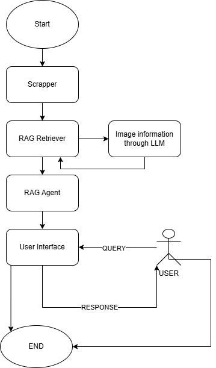
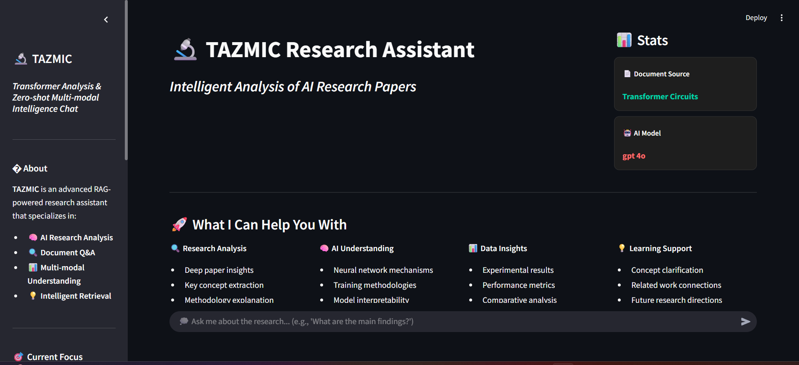
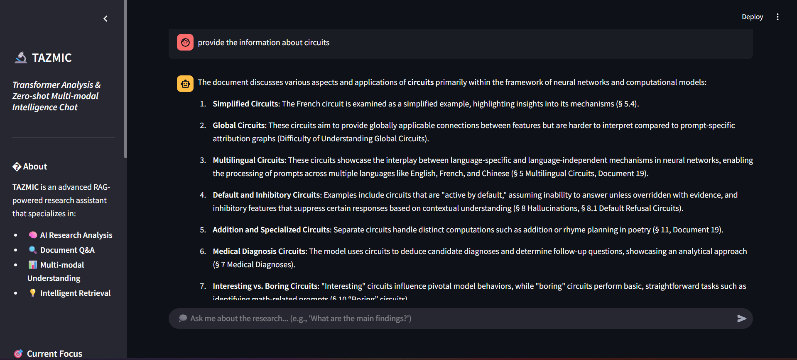
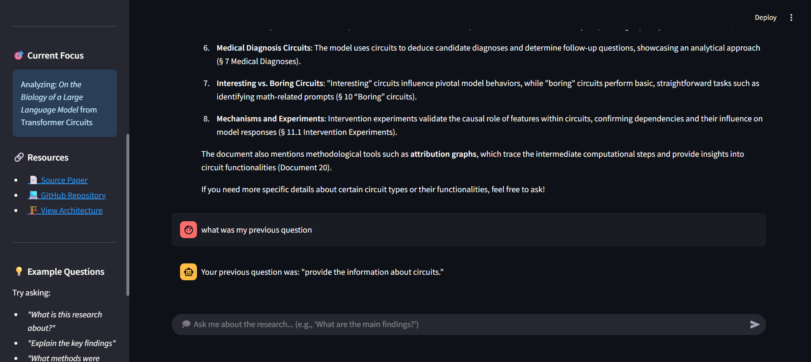

# RAG based research_assitant 🔬

**T**ransformer **A**nalysis and **Z**ero-shot **M**ulti-modal **I**ntelligence **C**hat

A sophisticated RAG (Retrieval-Augmented Generation) research assistant powered by Azure OpenAI and LangGraph that specializes in analyzing and answering questions about research papers, particularly focusing on transformer circuits and large language model biology.

🌐 **Docker Image:**
1. **Pull Image:**
   ```bash
   # To pull directly from docker
   docker pull rahula004/rag-research-assistant:latest
   ```
2. **Run Image:**
   ```bash
   # To pull directly from docker
   docker run -it -p 8501:8501 -e AZURE_OPENAI_ENDPOINT="<AZURE_OPENAI_ENDPOINT>" -e AZURE_OPENAI_API_KEY="<AZURE_OPENAI_API_KEY>" -e AZURE_OPENAI_API_VERSION="2024-12-01-preview" -e AZURE_OPENAI_LLM_DEPLOYMENT="gpt-4o" -e AZURE_OPENAI_EMBEDDING_DEPLOYMENT="text-embedding-3-small" -e FIRECRAWL_API_KEY="<FIRECRAWL_API_KEY>" rahula004/rag-research-assistant
   ```

## 🌟 Features

- **Intelligent Web Scraping**: Automatically scrapes research papers from transformer-circuits.pub using FireCrawl
- **Multi-modal Analysis**: Processes both text content and images from research papers
- **Vector Database Storage**: Uses ChromaDB for efficient document embedding and retrieval
- **Advanced RAG Pipeline**: Implements LangGraph-based agent system for sophisticated query processing
- **Interactive Web Interface**: Streamlit-based chat interface for easy interaction
- **Azure OpenAI Integration**: Leverages Azure's powerful language models and embeddings
- **Modular Architecture**: Clean, extensible codebase with separate modules for different functionalities

## 🏗️ Architecture

### System Workflow



_Complete workflow diagram showing the end-to-end process from document ingestion to query response_

## 🖥️ User Interface Showcase

### Main Dashboard



_Clean, intuitive interface featuring the research assistant with organized capabilities and intelligent chat system_

### Interactive Querying System



_Natural conversation interface demonstrating real-time research analysis and context-aware responses_

### Memory Retention & Context Management



_Advanced conversation flow showing TAZMIC's ability to maintain context and reference previous interactions_

### Key Interface Features

- **📊 Dynamic Stats Cards** - Real-time information about document sources and AI models
- **🎯 Capability Overview** - Clear presentation of research analysis features
- **💬 Intelligent Chat** - Context-aware conversations with research documents
- **🔍 Smart Responses** - Detailed, well-structured answers with proper citations
- **📚 Example Guidance** - Built-in suggestions to help users ask better questions
- **🧠 Context Retention** - Maintains conversation history and can reference previous queries
- **🔬 Research Analysis** - Deep analysis of transformer circuits and neural network mechanisms
- **🌐 Multi-modal Understanding** - Processes both text and visual content from research papers

## 🎯 Live Demo Capabilities

The screenshots above demonstrate TAZMIC's ability to:

1. **Complex Research Analysis** - Breaking down intricate AI concepts like transformer circuits into understandable explanations
2. **Contextual Memory** - Remembering previous questions and maintaining conversation flow
3. **Detailed Responses** - Providing comprehensive answers with proper structure and citations
4. **User-Friendly Interface** - Combining powerful AI capabilities with an intuitive, accessible design
5. **Real-time Processing** - Quick response times for complex research queries

### Project Structure

```
TAZMIC/
├── app.py                 # Streamlit web interface
├── src/
│   ├── main.py           # Main RAG agent implementation
│   ├── model.py          # Azure OpenAI model configurations
│   ├── retriever.py      # Document processing and vector store setup
│   ├── scrapper.py       # Web scraping functionality
│   ├── pipeline.py       # Complete pipeline orchestration
│   ├── mas.py            # Multi-agent system implementation
│   ├── image_info.py     # Image analysis capabilities
│   └── research/         # Jupyter notebooks for experimentation
├── artifacts/
│   ├── research_papers/  # Scraped content storage
│   └── Vector_databases/ # ChromaDB vector stores
├── pictures/
│   └── workflow.png      # System workflow diagram
└── requirements files
```

## 🚀 Getting Started

### Prerequisites

- Python 3.13+
- Azure OpenAI API access
- FireCrawl API key (for web scraping)

### Installation

1. **Clone the repository**

   ```bash
   git clone https://github.com/Rahulagowda004/RAG_based_research_assitant.git
   cd RAG_based_research_assitant
   ```

2. **Install dependencies**

   ```bash
   # Using uv (recommended)
   uv sync

   # Or using pip
   pip install -r requirements.txt
   ```

3. **Environment Setup**
   Create a `.env` file in the root directory:
   ```env
   AZURE_OPENAI_ENDPOINT=your_azure_endpoint
   AZURE_OPENAI_API_KEY=your_api_key
   AZURE_OPENAI_API_VERSION=2024-02-01
   AZURE_OPENAI_LLM_DEPLOYMENT=your_llm_deployment_name
   AZURE_OPENAI_EMBEDDING_DEPLOYMENT=your_embedding_deployment_name
   FIRECRAWL_API_KEY=your_firecrawl_api_key
   ```

### Usage

#### 1. Web Interface (Streamlit)

```bash
streamlit run app.py
```

#### 2. Command Line Interface

```bash
python src/main.py
```

#### 3. Complete Pipeline

```bash
python src/pipeline.py
```

## 🔧 Core Components

### RAG Agent (`main.py`)

- **LangGraph Implementation**: Uses state-based graph for complex query processing
- **Memory Management**: Maintains conversation context across interactions
- **Tool Integration**: Seamlessly integrates retrieval tools with LLM reasoning

### Document Processing (`retriever.py`)

- **Intelligent Chunking**: Uses RecursiveCharacterTextSplitter with optimal chunk sizes
- **Vector Storage**: ChromaDB integration with Azure OpenAI embeddings
- **Similarity Search**: Configurable retrieval with top-k results

### Web Scraping (`scrapper.py`)

- **FireCrawl Integration**: Professional web scraping with multiple format support
- **Content Extraction**: Markdown, screenshots, and link extraction
- **Data Organization**: Automatic file organization by content type

### Multi-modal Analysis (`image_info.py`)

- **Image Processing**: Automatic image description using vision-language models
- **Content Integration**: Seamlessly integrates image descriptions with text content

## 📊 Technical Specifications

### Dependencies

- **Core Framework**: LangGraph, LangChain
- **Vector Database**: ChromaDB
- **Web Interface**: Streamlit
- **AI Models**: Azure OpenAI (GPT-4, text-embedding-ada-002)
- **Web Scraping**: FireCrawl
- **Document Processing**: Unstructured

### Performance Features

- **Efficient Retrieval**: Similarity search with configurable parameters
- **Chunking Strategy**: 1000 character chunks with 200 character overlap
- **Memory Persistence**: Conversation state management
- **Error Handling**: Comprehensive error handling and logging

## 🎯 Use Cases

1. **Research Paper Analysis**: Deep dive into transformer circuits research
2. **Academic Q&A**: Answer specific questions about research methodologies
3. **Content Summarization**: Generate concise summaries of complex papers
4. **Multi-modal Understanding**: Analyze both text and visual content
5. **Interactive Learning**: Engage in conversations about AI research

## 🔬 Research Focus

Currently optimized for analyzing research from:

- **Transformer Circuits**: Understanding internal mechanisms of language models
- **AI Safety Research**: Analysis of model behavior and interpretability
- **Machine Learning Papers**: General ML research paper processing

## 🛠️ Development

### Project Structure

```
src/
├── main.py          # Main RAG agent
├── model.py         # Azure OpenAI models
├── retriever.py     # Document processing
├── scrapper.py      # Web scraping
├── pipeline.py      # Full pipeline
├── mas.py          # Multi-agent system
├── image_info.py   # Image analysis
└── research/       # Jupyter notebooks
```

### Key Features

- **Modular Design**: Each component is independently testable
- **Type Safety**: Comprehensive type hints throughout
- **Error Handling**: Robust error handling and logging
- **Configuration**: Environment-based configuration management

## 📈 Future Enhancements

- [ ] Support for additional research paper sources
- [ ] Enhanced multi-modal capabilities
- [ ] Advanced query understanding
- [ ] Batch processing capabilities
- [ ] API endpoint development
- [ ] Docker containerization improvements

## 🤝 Contributing

1. Fork the repository
2. Create a feature branch
3. Make your changes
4. Add tests if applicable
5. Submit a pull request

## 📄 License

This project is licensed under the MIT License - see the LICENSE file for details.

## 🙏 Acknowledgments

- **Anthropic**: For the Claude research that inspired this project
- **Transformer Circuits Team**: For the foundational research
- **LangChain/LangGraph**: For the excellent RAG framework
- **Azure OpenAI**: For providing powerful language models

## 📞 Support

For questions, issues, or contributions, please:

1. Check the existing issues
2. Create a new issue with detailed information
3. Contact the maintainers

---

**TAZMIC** - Transforming how we interact with AI research literature through intelligent retrieval and analysis.
